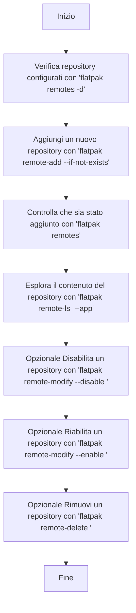

# 🧩 **Comandi Flatpak per la gestione dei repository**

### 🔍 **1. Consultazione e verifica**

Usati per esplorare i repository e il loro contenuto.

```bash
flatpak remotes                # Elenca tutti i repository configurati
flatpak remotes -d             # Mostra i dettagli completi dei repository
flatpak remotes --system       # Mostra solo i repository di sistema
flatpak remotes --user         # Mostra solo i repository dell’utente
flatpak remote-ls --app        # Elenca solo le applicazioni (esclude i runtime)
flatpak remote-ls fedora --app # Elenca le app disponibili in un repo specifico
```

---

### ➕ **2. Aggiunta di nuovi repository**

Usati per espandere le fonti di applicazioni Flatpak.

```bash
flatpak remote-add --if-not-exists fedora oci+https://registry.fedoraproject.org
flatpak remote-add --if-not-exists --user flathub https://dl.flathub.org/repo/flathub.flatpakrepo
```

Opzioni principali:

* `--if-not-exists` → evita sovrascritture se il repo esiste già.
* `--user` → aggiunge il repo solo per l’utente corrente (non a livello di sistema).

---

### 🧱 **3. Modifica dello stato di un repository**

Permette di abilitare o disabilitare temporaneamente un repository senza rimuoverlo.

```bash
flatpak remote-modify --disable fedora   # Disabilita un repo
flatpak remote-modify --enable fedora    # Riabilita un repo
```

---

### ❌ **4. Rimozione di repository**

Usato per eliminare completamente un remote (dopo aver rimosso i pacchetti associati).

```bash
flatpak remote-delete fedora
```

👉 Il comando chiede conferma e rimuove tutte le app/runtimes installate da quel repo.

---

## 🧭 **Flusso logico didattico**

 




---

 
